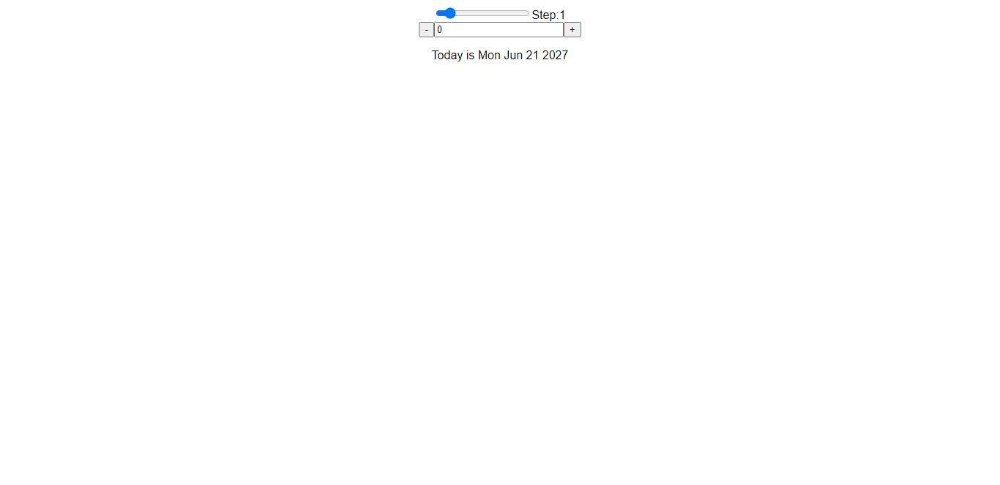

# Datecounter
This is a simple React application that counts down the number of days until a specified date.A user can reset the number of days.The application uses event handlers, React state, and conditional rendering to achieve its functionality.

# Getting Started
To run the application, you will need to have Node.js and NPM installed. Once you have those installed, you can run the following commands to install the dependencies and start the application:

Code snippet

npm install

npm start

Use code with caution. Learn more
The application will then be served on port 3000. You can open a web browser and navigate to localhost:3000 to view the application.

# Images

# Practise Problem
1.Understand How to useState hook

2.Understand how to set state and update state.

3.Understand how eventHandlers is used [onClick]..

4.Understand how to control element state within a component.

# Author
This application was created by [Emmanuel].

# License
This application is licensed under the MIT License.

# Contact
If you have any questions or feedback, please contact koechemmanuel2002@gmail.com

